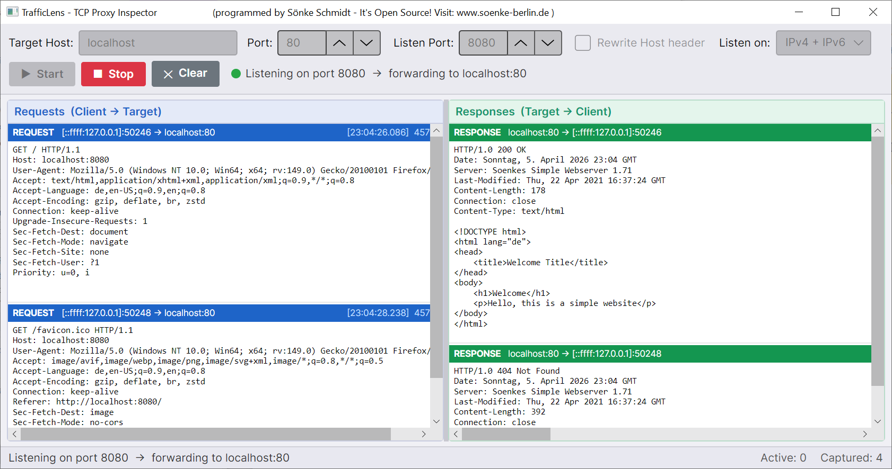
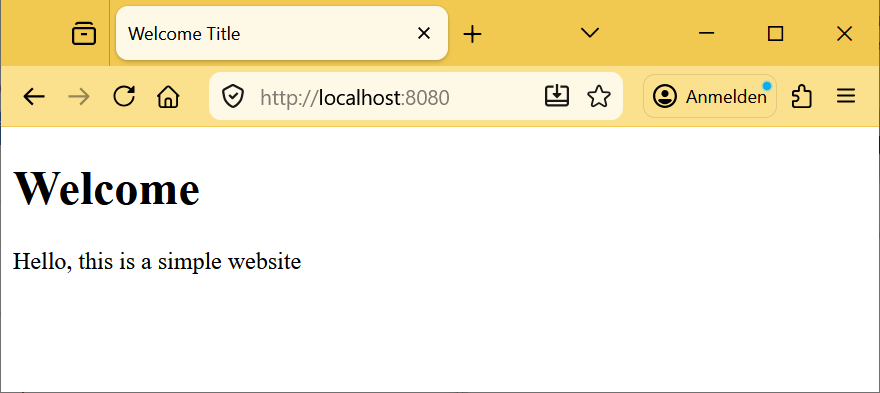

# TrafficLens

> A lightweight TCP proxy inspector — sit between two services, capture every byte, and understand exactly what is being exchanged.


---

## What it does

TrafficLens acts as a **transparent TCP man-in-the-middle proxy**. It listens on a configurable local port and forwards all incoming traffic to a configured target host and port. Responses from the target are relayed back to the original caller. Every byte flowing in either direction is captured and displayed live in the GUI.

**Primary use case:** Debugging inter-service communication in .NET solutions — e.g. understanding what API calls a client project makes against a backend API project, including timing, payloads, and error responses.

```
┌──────────────┐    TCP     ┌─────────────────┐    TCP     ┌──────────────┐
│  API Client  │ ─────────► │  TrafficLens    │ ─────────► │  API Server  │
│  (your app)  │ ◄───────── │  (this tool)    │ ◄───────── │  (your app)  │
└──────────────┘            └─────────────────┘            └──────────────┘
                                    │
                          live display in GUI
```

## Releases and Downloads

[Actual Stable Version is 1.0 (click here to go to Release Page)](https://github.com/Ydobemos/TrafficLens/releases/tag/v1.0) <br>
This is version 1.0, and there will probably be no further versions, as the project is pretty much complete for me.
TrafficLens is available for download as a zip file for various operating systems (Windows, Linux, macOS) and architectures (x64, x86, arm, arm64).

## Screenshots

The program has a simple, intuitive, and minimalist design.
In the following example, TrafficLens listens on port 8080 and forwards everything to localhost on port 80 (where a web server is running).


It can not only be used between two services, but also by using your browser to access the (web) server (via TrafficLens). For example:



## Features

- **Two traffic panels** — Requests (client → server) and Responses (server → client) displayed side by side with colour-coded headers
- **Selectable headers** — endpoint info, direction and timestamp in the header bar can be selected and copied
- **Human-readable output** — Text-based payloads (HTTP, JSON, XML, …) are shown as UTF-8; binary data is rendered as a hex dump
- **Host header rewriting** — Optionally rewrites the HTTP `Host` header to match the configured target, so named virtual hosts resolve correctly (toggleable via checkbox)
- **IPv4 and IPv6 support** — The listener mode can be set to **IPv4 only**, **IPv4 + IPv6** (dual-stack, default) or **IPv6 only**. IPv6 target addresses in URL bracket notation (e.g. `[::1]`) are accepted and handled correctly
- **Multi-connection support** — Handles concurrent TCP connections with an active-connection counter
- **Live clear** — Wipe the log at any time without stopping the proxy
- **Thread-safe UI** — All captures are dispatched safely to the UI thread
- **Cross-platform** — Runs on Windows, Linux and macOS thanks to [Avalonia UI](https://avaloniaui.net/)

## Getting Started

### Prerequisites

- [.NET 10 SDK](https://dotnet.microsoft.com/download/dotnet/10.0)

### Build & Run

```bash
git clone https://github.com/your-name/TrafficLens.git
cd TrafficLens
dotnet run --project TrafficLens/TrafficLens.csproj
```

Or open `TrafficLens.sln` in Visual Studio 2022+ / Rider and press **F5**.

### Self-contained single-file publish

```bash
# Windows
dotnet publish TrafficLens/TrafficLens.csproj -r win-x64 -c Release --self-contained -p:PublishSingleFile=true

# Linux
dotnet publish TrafficLens/TrafficLens.csproj -r linux-x64 -c Release --self-contained -p:PublishSingleFile=true

# macOS
dotnet publish TrafficLens/TrafficLens.csproj -r osx-x64 -c Release --self-contained -p:PublishSingleFile=true
```

## Usage

1. Enter the **Target Host** and **Target Port** of the service you want to intercept (e.g. `localhost` / `5000`). IPv6 addresses can be entered with or without brackets (e.g. `[::1]` or `::1`).
2. Enter the **Listen Port** — the port TrafficLens will expose locally (e.g. `8080`).
3. Select the **Listen on** mode — see below.
4. Enable **Rewrite Host header** if your target uses named virtual hosts (see note below).
5. Click **▶ Start**.
6. Point your client application at the listen port instead of the real service.
7. Watch requests and responses appear in real time.
8. Click **■ Stop** to shut down the proxy. Click **✕ Clear** to wipe the log.

### The "Listen on" option

Controls which IP protocol the listener accepts:

| Setting | Behaviour |
|---|---|
| **IPv4 only** | Binds to `0.0.0.0` — accepts only IPv4 clients. Addresses appear as `x.x.x.x` in the log. |
| **IPv4 + IPv6** | Binds to `::` with dual-stack mode — accepts both IPv4 and IPv6 clients on a single port (default). |
| **IPv6 only** | Binds to `::` without dual-stack — accepts only IPv6 clients. |

> **Tip:** If you connect via `localhost` and always see an IPv6 address in the log, switch to **IPv4 only** to force IPv4 resolution.

### The "Rewrite Host header" option

When a browser or HTTP client connects to `localhost:8080`, it sends the HTTP header `Host: localhost`. If the target server uses **named virtual hosting** (very common with nginx, IIS, Apache), it uses this header to decide which site to serve. Receiving `Host: localhost` instead of the real hostname, the server may return a default page or a `404` rather than the expected content.

Enabling **Rewrite Host header** instructs TrafficLens to replace the `Host` value in every outgoing request with the configured target host before forwarding it. The response is passed back unmodified.

> **Tip:** For purely local service-to-service traffic (e.g. `localhost:5000` ↔ `localhost:8080`) this option is usually not needed and can be left off.

> **Limitation:** TrafficLens rewrites the `Host` header only in the first request per TCP connection. That is usually fine and sufficient. With HTTP keep-alive, a browser may send multiple requests over the same connection — subsequent requests will retain the original `Host` value (e.g. `localhost`) and may therefore fail on a virtual-host-based server. If you observe that only the first request succeeds, disable keep-alive on the client side or use a tool with full HTTP parsing (e.g. mitmproxy).

## HTTP → HTTPS redirects and TLS limitations

If you point TrafficLens at a server that enforces HTTPS — which is standard practice for any public-facing site — you will likely see a response like this:

```
HTTP/1.1 301 Moved Permanently
Location: https://www.your-domain.com/
```

This is **not a bug in TrafficLens**. It is the server doing exactly what it is configured to do: redirect every plain HTTP request to its HTTPS equivalent. Once the browser follows that redirect it connects directly to `https://your-domain.com:443`, bypassing TrafficLens entirely, and the URL bar will show the real domain instead of `localhost`.

### Why TrafficLens cannot intercept HTTPS traffic

TrafficLens operates at the **raw TCP level**. It forwards bytes as-is and has no concept of TLS. Intercepting HTTPS requires:

1. **TLS termination** — the proxy must complete a TLS handshake with the client, which means it must present a certificate the client trusts.
2. **Certificate issuance** — the proxy must dynamically generate a certificate for the target domain and install a custom root CA in the client's trust store.
3. **Re-encryption** — the proxy then opens its own TLS connection to the real server and forwards decrypted/re-encrypted data in both directions.

This is a fundamentally different (and significantly more complex) architecture. For HTTPS interception you should use a dedicated tool:

| Tool | Platform | Notes |
|---|---|---|
| [Fiddler Classic](https://www.telerik.com/fiddler/fiddler-classic) | Windows | Free, excellent for HTTP(S) debugging |
| [Fiddler Everywhere](https://www.telerik.com/fiddler) | Win / macOS / Linux | Cross-platform, commercial |
| [mitmproxy](https://mitmproxy.org/) | Win / macOS / Linux | Open-source, CLI + web UI |
| [Burp Suite Community](https://portswigger.net/burp/communitydownload) | Win / macOS / Linux | Free tier, popular for security testing |

**TrafficLens is intentionally kept simple** and works best for plain HTTP or custom TCP-based inter-service communication where no TLS is involved — a very common scenario when debugging two .NET services talking to each other on a local network or within a development environment.

## Project Structure

```
TrafficLens/
├── TrafficLens.sln
└── TrafficLens/
    ├── Program.cs
    ├── App.axaml / App.axaml.cs       # Avalonia application entry point
    ├── Models/
    │   ├── TrafficEntry.cs            # Immutable record for one captured chunk
    │   ├── TrafficEventArgs.cs        # EventArgs wrapper
    │   └── ListenMode.cs              # Enum: IPv4Only | DualStack | IPv6Only
    ├── Core/
    │   ├── ProxyServer.cs             # TcpListener, connection lifecycle
    │   └── ConnectionHandler.cs       # Bidirectional forwarding + Host rewriting
    ├── Views/
    │   ├── MainWindow.axaml           # UI layout
    │   └── MainWindow.axaml.cs        # Code-behind (auto-scroll only)
    └── ViewModels/
        ├── MainWindowViewModel.cs     # Proxy orchestration, commands, state
        └── TrafficEntryViewModel.cs   # Display model for one traffic entry
```

## License

MIT — do whatever you want, just don't blame me if your production traffic ends up on screen.
